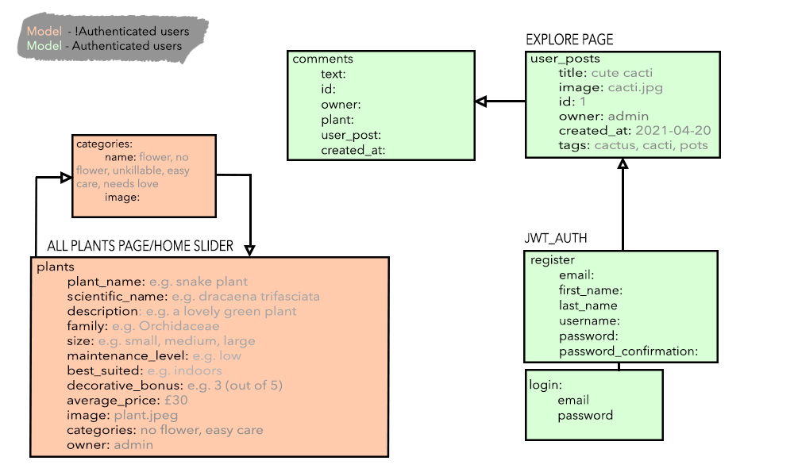

# General Assembly Project 4: GreenHouse

## Goal:
Create a full-stack app using React, Python, Django and PostgreSQL.

## Timeframe:
7 Days

## Description:
GreenHouse allows users to browse for different types of plants to use for interior/exterior decorating. It also allows them to share their own pictures. These pictures appear on the Explore page, a compilation of all posts submitted.

# GreenHouse

# Deployed app:
To explore all features, use these login credentials:

email: admin@email.com
password: adminpass

## Technologies used
### Frontend:
- React
- Axios
- Semantic UI React
- Semantic UI
- SCSS
- HTTP-proxy-middleware
- React Router DOM
### Backend:
- Python
- Django
- Django REST Framework
- Psycopg2
- PyJWT
### Development tools:
- VSCode
- Insomnia
- Yarn
- Git & GitHub
- Google Chrome development tools
- Trello Board (planning)
- Adobe Photoshop 2021 (project assets and wireframes)
- Heroku (deployment)

## Installation
Clone or download sei-project-four repo then run these in Terminal:
* `pipenv` to install Python packages
* `pipenv shell` to enter virtual environment
* `python manage.py makemigrations` to prepare migrations
* `python manage.py migrate` to migrate
* `python manage.py loaddata comments/seeds.json` to seed data for comments
* `python manage.py loaddata categories/seeds.json` to seed data for categories
* `python manage.py loaddata plants/seeds.json` to seed data for plants
* `python manage.py loaddata posts/seeds.json` to seed data for user posts
* `python manage.py runserver` to start back-end server
* `cd client` to go into the front-end directory
* `yarn` to install front-end dependencies
* `yarn start` to start front-end server

# PROCESS
## PLANNING
## Concept
From the start of the course, I had planned on doing a plant-centric app/website so I immediately knew that that was what I would do for my final project. I decided to do the project solo because I wanted to prove to myself that I could do a more complex website and understand the combination of concepts better through independent struggling and problem-solving. At the beginning of the planning stage, I made sure to establish first the "story" of the app and the way components linked/interacted with each other. I used Miro to create the steps representing the user journey and Photoshop to create a wireframe and ERD.

### Relationships (ERD)

