# General Assembly Project 4: GreenHouse

----
# Table of Contents
* Project Brief
* Project Description
* Technologies & Installation
* Process
   - Planning
   - Backend
   - Frontend
* Final Walkthrough
* Wins & bugs
* Extra Features
 
## Project Brief:
* **Build a full-stack application** by making your own backend and your own front-end
* **Use a Python Django API** using Django REST Framework to serve your data from a Postgres database
* **Consume your API with a separate front-end** built with React
* **Be a complete product** which most likely means multiple relationships and CRUD functionality for at least a couple of models
* **Implement thoughtful user stories/wireframes** that are significant enough to help you know which features are core MVP and which you can cut
* **Have a visually impressive design** to kick your portfolio up a notch and have something to wow future clients & employers. **ALLOW** time for this.
* **Be deployed online** so it's publicly accessible.
 
## Timeframe:
7 Days
 
## Description:
GreenHouse allows users to browse for different types of plants to use for interior/exterior decorating. It also allows them to share their own pictures. These pictures appear on the Explore page, a compilation of all posts submitted.
 
### Deployed version:
https://greenhouse-app.herokuapp.com/
 
To explore the app, use these login credentials:
 
<b>email</b>: admin@email.com <br />
<b>password</b>: adminpass
 
## Technologies used
### Frontend:
- React
- Axios
- Semantic UI React
- Semantic UI
- SASS
- HTTP-proxy-middleware
- React Router DOM
### Backend:
- Python
- Django
- Django REST Framework
- Psycopg2
- PyJWT
### Development tools:
- VSCode
- Insomnia
- Yarn
- Git & GitHub
- Google Chrome development tools
- Miro (storyboard)
- Trello Board (planning)
- Adobe Photoshop 2021 (logo and wireframes)
- Cloudinary
- Heroku (deployment)
 
## Installation
Clone or download sei-project-four repo then run these in Terminal:
* `pipenv` to install Python packages
* `pipenv shell` to enter virtual environment
* `python manage.py makemigrations` to prepare migrations
* `python manage.py migrate` to migrate
* `python manage.py loaddata comments/seeds.json` to seed data for comments
* `python manage.py loaddata categories/seeds.json` to seed data for categories
* `python manage.py loaddata plants/seeds.json` to seed data for plants
* `python manage.py loaddata posts/seeds.json` to seed data for user posts
* `python manage.py runserver` to start back-end server
* `cd client` to go into the front-end directory
* `yarn` to install front-end dependencies
* `yarn start` to start front-end server
* go to localhost:8000 in browser to see app
 
# PROCESS
## PLANNING (day 1)
### Concept
From the start of the course, I had planned on doing a plant-centric app/website so I immediately knew that that was what I would do for my final project. I decided to do the project solo because I wanted to prove to myself that I could do a more complex website and understand the combination of concepts better through independent struggling and problem-solving. At the beginning of the planning stage, I made sure to establish first the "story" of the app and the way components linked/interacted with each other. I used Miro to create the steps representing the user journey and Photoshop to create a wireframe and ERD.
 
### Relationships (ERD)
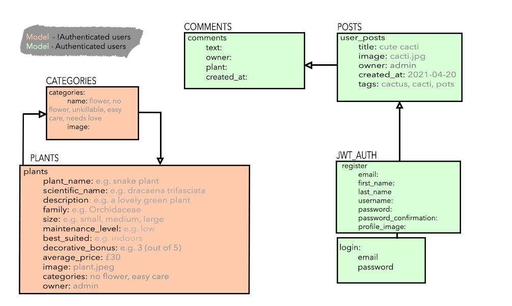
 
### Storyboard
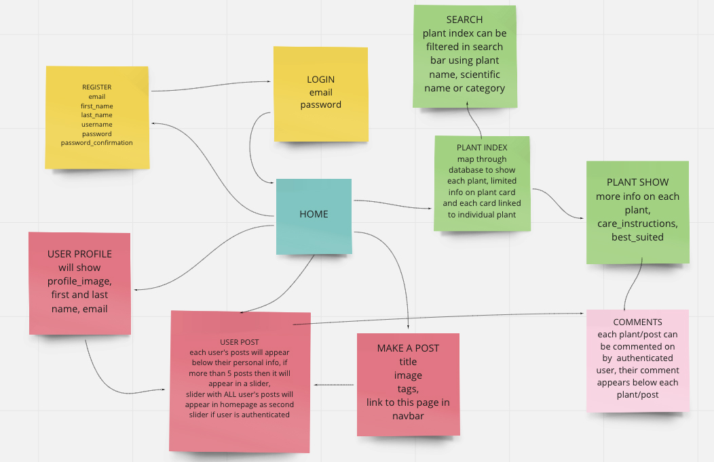
 
### Wireframes
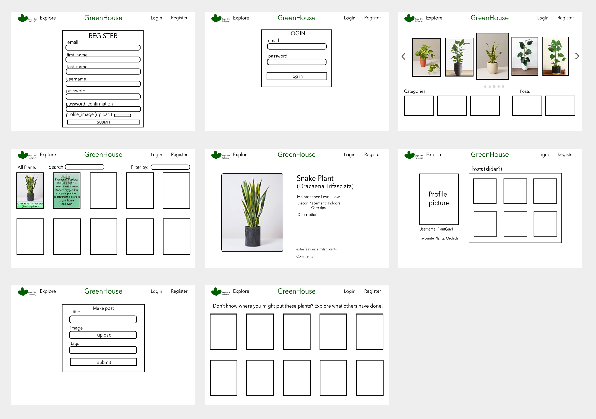
 
I knew that having complex interlinked models in a solo project would be easily overwhelming so I used a Trello board to organise myself. I split the project into backend, frontend, webpages(components), extra functions and bugs, including a list for components that are finished and styled. This definitely helped me delegate tasks evenly each day and to see what I need to prioritise in order to reach the minimum viable product (MVP). Although working on my own, I made sure to stay on Zoom all day in case I needed to quickly reach out to instructors for help which I did twice throughout the project. I also made sure to use and check Slack regularly for help from my classmates or to see if they were having similar obstacles. It made things go smoother and less stressful.
 
### Trello Organisation
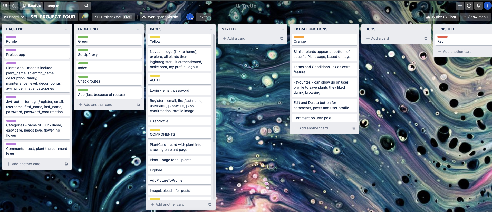
 
## BACKEND (day 2 & 3)
### Setup
To create a PostgreSQL database, I used a Django REST Framework. The backend has 5 models: categories, comments, users, plants and user posts.
 
The jwt_auth app was created first to ensure that the user model was established <i>before</i> I needed to create a superuser to access the database.
``` python
class User(AbstractUser):
   email = models.CharField(max_length=50, unique=True)
   first_name = models.CharField(max_length=50)
   last_name = models.CharField(max_length=50)
   profile_image = models.CharField(max_length=1000)
```
 
However, this threw an unexpected error. I successfully created the model but it would not let me create a superuser. This was a bigger obstacle than I expected. It took a few hours to get through and most of day 2 was spent trying to correct it. In the end, my solution was to delete the jwt_auth app, create the other models first and to create a superuser before. Because this would throw an error due to an already existing user conflicting with a new user model, there were extra steps that needed to be taken before I could successfully install the model. I deleted all the seeds files for each app, ran `python manage.py dumpdata app-name --output app-name/seeds.json --indent=2` in the terminal, dropped the database using `dropdb greenhouse`, deleted all migration files for all apps, re-created the database running `createdb greenhouse`, made my migrations then reseeded all apps by running `python manage.py loaddata plants/seeds.json` for each.
 
The next error was also unexpected but easier to resolve. I input a function into the jwt_auth admin.py file to inform django to use our new user model:
```python
User = get_user_model()
 
admin.site.register(User)
```
 
I tried to create a new user but this threw an error due to a user already being registered prior to the user model's creation. My solution was to add an unregister function to prevent triggering the error.
 
```python
User = get_user_model()
 
admin.site.unregister(User)
 
admin.site.register(User)
```
 
I managed to create another user after. I deleted the unregister code afterwards which re-triggered the error. It wasn't until I deleted the first superuser that I could note out the unregister code.
```python
 
User = get_user_model()
 
# admin.site.unregister(User) # had to drop db and still somehow has User registered on app 'jwt_auth', already registered error triggers so need to unregister first then register
admin.site.register(User)
```
This was the problem that made the backend setup longer than I intended. However, the rest of the app setup afterwards was more straightforward.
 
 
The Plant Model was the main model for the database:
``` python
class Plant(models.Model):
   plant_name = models.CharField(max_length=50)
   scientific_name = models.CharField(max_length=50)
   description = models.CharField(max_length=400)
   care_instructions = models.CharField(max_length=1500)
   family = models.CharField(max_length=50)
   size = models.CharField(max_length=50)
   maintenance_level = models.CharField(max_length=50)
   best_suited = models.CharField(max_length=50)
   image = models.CharField(max_length=1000)
   decorative_bonus = models.PositiveIntegerField()
   average_price = models.PositiveIntegerField()
   categories = models.ManyToManyField('categories.Categories', related_name="plants")
   owner = models.ForeignKey(
       'jwt_auth.User',
       related_name='created_plants',
       on_delete = models.CASCADE
   )
 
   def __str__(self):
       return f"{self.plantname} - {self.scientificname}"
```
 
The field `careinstructions` was added after I had connected the backend to the frontend. Most of the fields were filled in using information from https://www.patchplants.com/gb/en/. Each plant image used was from this website.
 
The plants app views.py has 4 different requests:
``` python
class PlantListView(APIView):
   permission_classes = (IsAuthenticatedOrReadOnly,) 
  
   # ALL PLANTS
   def get(self, _request):
       plants = Plant.objects.all() # return everything from the db
       serialized_plants = PopulatedPlantSerializer(plants, many=True) # convert the data
       return Response(serialized_plants.data, status=status.HTTP_200_OK)
 
   def post(self, request):
       request.data["owner"] = request.user.id
       plant_to_add = PlantSerializer(data=request.data)
       if plant_to_add.is_valid():
           plant_to_add.save()
           return Response(plant_to_add.data, status=status.HTTP_201_CREATED)
       return Response(plant_to_add.errors, status=status.HTTP_422_UNPROCESSABLE_ENTITY)
 
 
class PlantDetailView(APIView):
 
   permission_classes = (IsAuthenticatedOrReadOnly,) 
 
   def get_plant(self, pk):
       try:
           return Plant.objects.get(pk=pk)
       except Plant.DoesNotExist:
           raise NotFound(detail="🌱 Cannot find that plant")
 
   # ONE PLANT
   def get(self, _request, pk):
       plant = self.get_plant(pk=pk)
       serialized_plant = PopulatedPlantSerializer(plant)
       return Response(serialized_plant.data, status=status.HTTP_200_OK)
 
   def delete(self, _request, pk):
       plant_to_delete = self.get_plant(pk=pk)
       plant_to_delete.delete()
       return Response(status=status.HTTP_204_NO_CONTENT)
 
   def put(self, request, pk):
       plant_to_edit = self.get_plant(pk=pk)
       updated_plant = PlantSerializer(plant_to_edit, data=request.data)
       if updated_plant.is_valid():
           updated_plant.save()
           return Response(updated_plant.data, status=status.HTTP_202_ACCEPTED)
       return Response(updated_plant.errors, status=status.HTTP_422_UNPROCESSABLE_ENTITY)
```
These requests are only available to the admin user and not any user that registers with the website, authenticated or not. Besides login and register, only the posts app POST request and comments app POST request concerns the authenticated user:
 
<b> posts app views.py </b>
```python
class PostListView(APIView):
   permission_classes = (IsAuthenticatedOrReadOnly,)
 
   def post(self, request):
       request.data["owner"] = request.user.id
       post_to_create = PostSerializer(data=request.data)
       if post_to_create.is_valid():
           post_to_create.save()
           return Response(post_to_create.data, status=status.HTTP_201_CREATED)
       return Response(post_to_create.errors, status=status.HTTP_422_UNPROCESSABLE_ENTITY)
```
 
<b> comments app views.py </b>
``` python
class CommentListView(APIView):
 
   permissions_classes = (IsAuthenticated,)
 
# if comment is valid, save it and return 201 and if not, return error and 422
   def post(self, request):
       request.data["owner"] = request.user.id
       comment_to_create = CommentSerializer(data=request.data)
       if comment_to_create.is_valid():
           comment_to_create.save()
           return Response(comment_to_create.data, status=status.HTTP_201_CREATED)
       return Response(comment_to_create.errors, status=status.HTTP_422_UNPROCESSABLE_ENTITY)
```
 
Each app's model was tested in Insomnia and TablePlus before moving onto creating the next app. This ensured that I caught any errors for each model without letting them accumulate.
 
The morning of day 3 was used to ensure that the backend was up and running smoothly. At this point, all requests were working, the models were how I had planned them to be in the ERD, and the relationships between them were established.
 
Creating a back-end using Python was simultaneously hectic and straightforward. Establishing relationships between the apps and understanding the necessities of the models and serializers were easy. It was the errors that were really difficult to get through. However, this really helped improve my problem solving especially as this was my first time using Python/Django and had no prior experience debugging with this language.
 
<!-- I found Django to be a reliable database management system.  -->
 
 
## FRONTEND (day 3, 4, 5, 6 & 7)
The latter part of day 3 was used to set up the front end. Starting the setup was also as hectic as the backend. When installing postgres/django, node became unlinked. This was fixed using a series of Terminal commands to uninstall and re-install node through Homebrew.
 
The rest of the frontend steadily became easier to work on. I created the basic components first: Navbar, Home, Register, Login, PlantShow and PlantIndex. There was a notable error with using the backend model field names in the frontend. Due to using snake case for the backend, the frontend would not accept the field names if they weren't in camel case. Solutions I researched such as tweaking the linter files to ignore this did not work. Thus, I had to return to the backend and change the field names from snake case to camel case and remigrate the changes.
```python
class Plant(models.Model):
   plantname = models.CharField(max_length=50)
   scientificname = models.CharField(max_length=50)
   description = models.CharField(max_length=400)
   careinstructions = models.CharField(max_length=1500)
   family = models.CharField(max_length=50)
   size = models.CharField(max_length=50)
   maintenancelevel = models.CharField(max_length=50)
   bestsuited = models.CharField(max_length=50)
   image = models.CharField(max_length=1000)
   decorativebonus = models.PositiveIntegerField()
   averageprice = models.PositiveIntegerField()
```
It wasn't the most desirable solution but I needed to move onto the rest of the components. It was here I realised that I had overestimated the time I had for finishing the rest of the project, specifically time for the more complex functions and styling. The UI design I created in the wireframes would take slightly longer to implement than I expected. I made a list prioritising the other components and functions that I wanted to finish for my MVP. These were:
 - The sliders in the homepage using the Slider from 'react-slick' which is a carousel component:
``` javascript
 const config = {
   // dots: true,
   infinite: true,
   speed: 500,
   slidesToShow: 3,
   slidesToScroll: 1,
   centerMode: true,
   centerPadding: '80px',
   focusOnSelect: true,
   draggable: true,
   autoplay: true,
   autoplaySpeed: 3000,
 }
```
 - The user profile showcasing each user's posts. A slider also appears on the user profile to display the posts, but only if the user's number of posts are greater than 5:
``` javascript
           <h2 className="recent-activity">Recent activity</h2>
           { profile.posts.length > 5 ?
             <div className="profile-slider">
               <Slider {...config}>
                 {profile.posts.map(post => (
                   <SlideShow key={post.id} {...post} />
                 ))}
               </Slider>
             </div>
             :
             <>
               <div className="profile-posts">
                 {profile.posts.map(post => (
                   <div className="less-than-five" key={post.id}>
                     </img>
                   </div>
                 ))}
               </div>
             </>
           }
```
 - Making a post page/image upload where I used Cloudinary to allow users to upload and preview their images before submission:
```javascript
const uploadUrl = process.env.REACT_APP_CLOUDINARY_URL
const uploadPreset = process.env.REACT_APP_CLOUDINARY_UPLOAD_PRESET
 
export const ImageUploadField = ({ handleImageUrl, value }) => {
 
 const handleUpload = async event => {
   const data = new FormData()
   data.append('file', event.target.files[0])
   data.append('upload_preset', uploadPreset)
   const response = await axios.post(uploadUrl, data)
   handleImageUrl(response.data.url)
 }
```
 
When starting on the user profile and user posts, I realised I forgot to create a posts app on the backend for the users to be able to create new posts on the app. Setting this up was straightforward. However, because posts were being populated into the `PopulatedUserSerializer`,
```python
class PopulatedUserSerializer(UserSerializer):
   posts = PostSerializer(many=True)
```
 
This meant that when registering, new users would need to make a post right away as it was a requirement for the register POST request which presented a problem. My solution was simply to add the `blank=True` code so those fields would not be required and `null=True` so that the database column for the field can allow `NULL` values.
```python
class Post(models.Model):
  
   title = models.CharField(max_length=50, null=True, blank=True)
   image = models.CharField(max_length=1000, null=True, blank=True)
   created_at = models.DateTimeField(auto_now_add=True)
   tags = models.CharField(max_length=1000, null=True, blank=True)
```
 
Furthermore, on the Register component, while the 'posts' field could be empty, the field 'post' itself needed to be included in the Register form.
``` javascript
 const [form, setForm] = useState({
   username: '',
   first_name: '',
   last_name: '',
   email: '',
   password: '',
   password_confirmation: '',
   profile_image: '',
   posts: [],
 })
```
However, I did not want this to appear in the form so although I had to include it in the JSX,
``` javascript
             <div className="post-field">
               <label>
                 <i className="ui upload icon"> </i>
           Posts
               </label>
               <input
                 name="posts"
                 value={form.posts}
                 onChange={handleChange}
                 handleImageUrl={handleImageUrl}
               />
             </div>
```
 
I made it invisible using the CSS which solved the issue.
``` CSS
.post-field{
 display:none;
}
```
 
It was during days 4/5 when I got into a more comfortable pace building out the project and actually understanding the way React and Django were interacting. Although the beginning of the project was chaotic, the halfway point became less stressful. I began to enjoy the process more and actually feel excited about the final product.
 
One specific function that I really wanted to have was for the user to be able to search and filter the plants based on categories. I assumed this would be easy to implement into the search field through the handleChange function:
```javascript
 const handleChange = (event) => {
   try {
     const filteredArray = plants.filter(plant => {
       return (plant.plantname.toUpperCase().includes(event.target.value.toUpperCase())) || (plant.maintenancelevel.toUpperCase().includes(event.target.value.toUpperCase())) || (plant.scientificname.toUpperCase().includes(event.target.value.toUpperCase()))
     })
     setFilteredPlants(filteredArray)
     if (filteredArray.length === 0) {
       setErrors('error')
     }
     if (filteredArray.length > 0) {
       setErrors('')
     }
   } catch (err){
     console.log(err)
   }
 
 }
```
 
Filtering by categories did not work. I had to find a cheat solution which was to use maintenancelevel as the replacement for the categories. This meant that the categories app were not being put to use and was added to the list of bugs.
 
### Styling
I wanted to try something different for styling and use Semantic UI/Semantic UI React. This was the first project I've done using only these frameworks. I found it to be very straightforward and made the website look simple and clean as I intended. I implemented a nature theme throughout the app, using hi-res images from https://unsplash.com/ as backgrounds for the Register, Login, Home, and MakePost components. The fonts I used were modern, readable and adhered to the feel of the app.
 
## Final project walkthrough
Homepage:
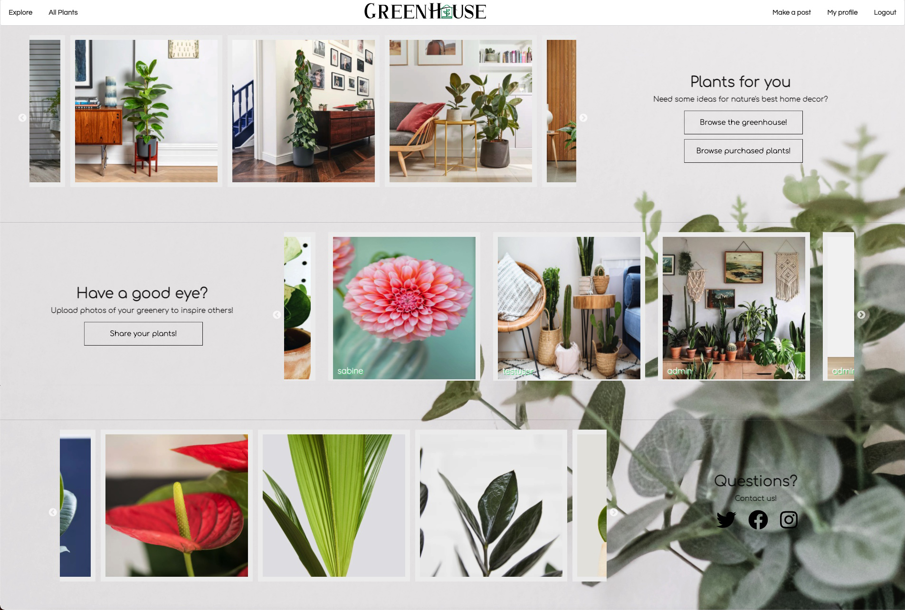
 
Register:
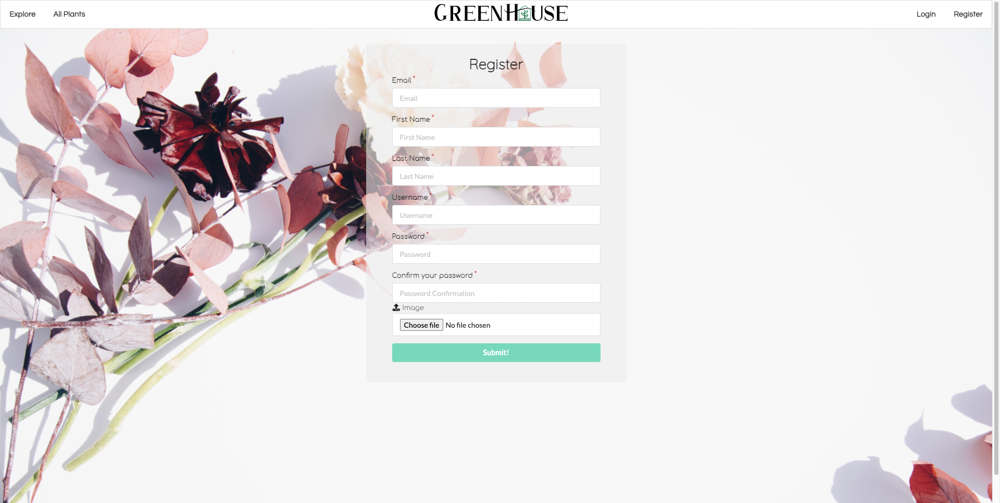
 
Login:
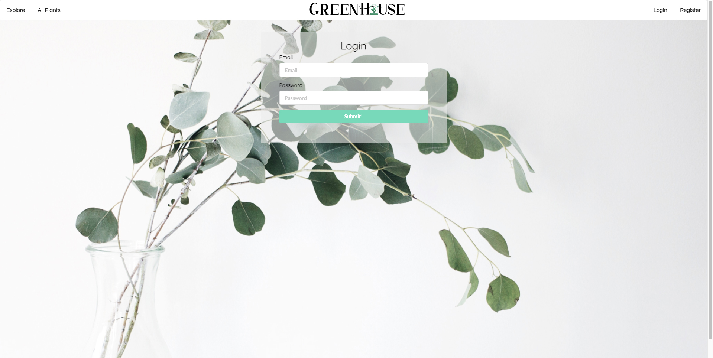
 
PlantIndex
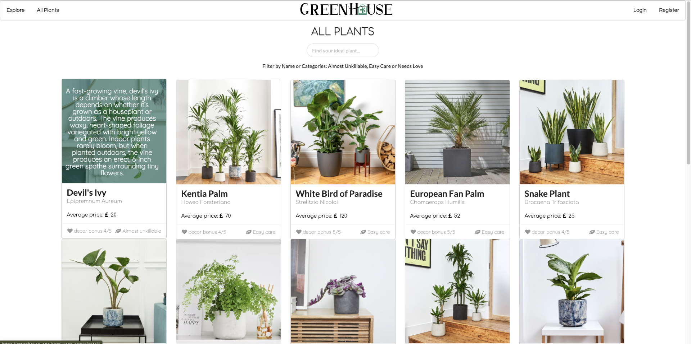
 
PlantShow:
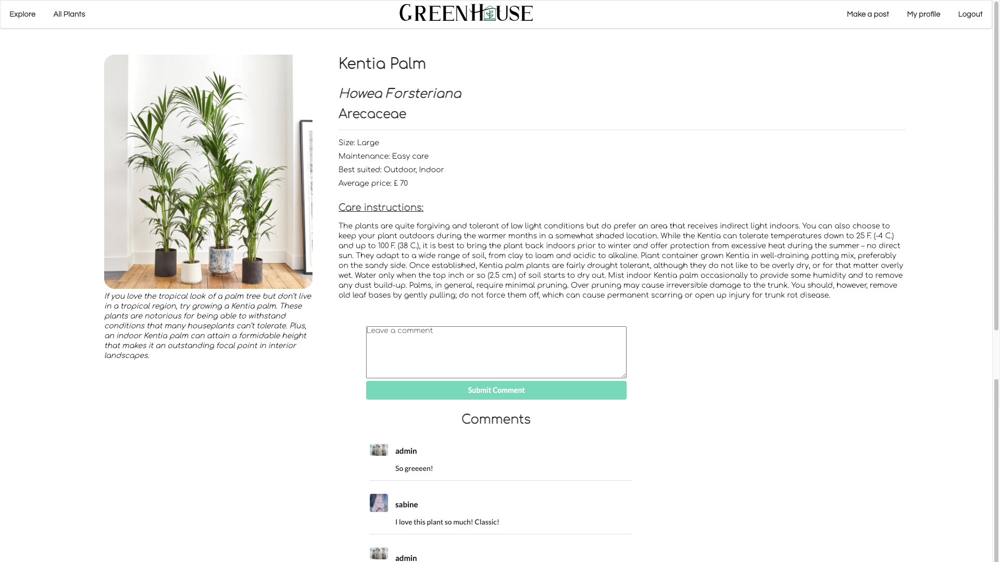
 
Explore:
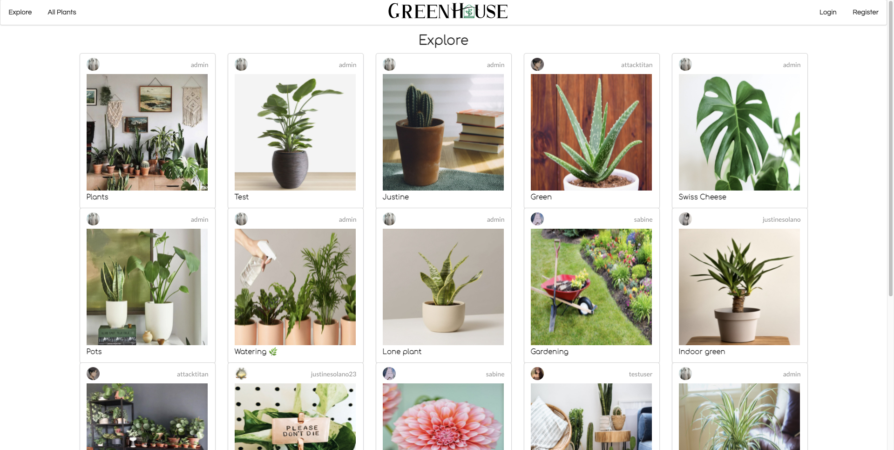
 
MakePost:
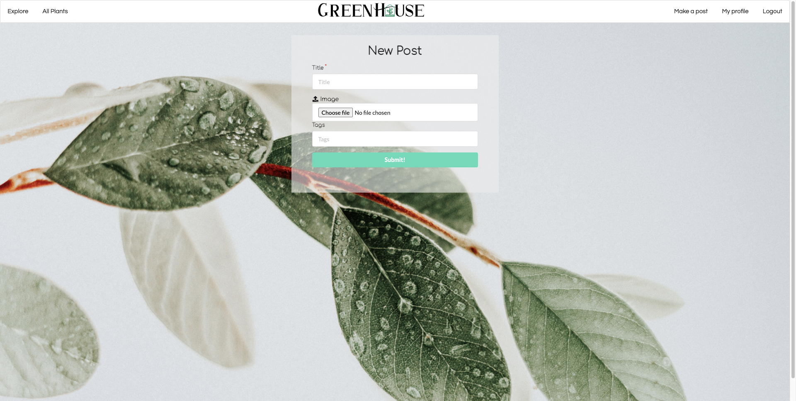
 
UserProfile:
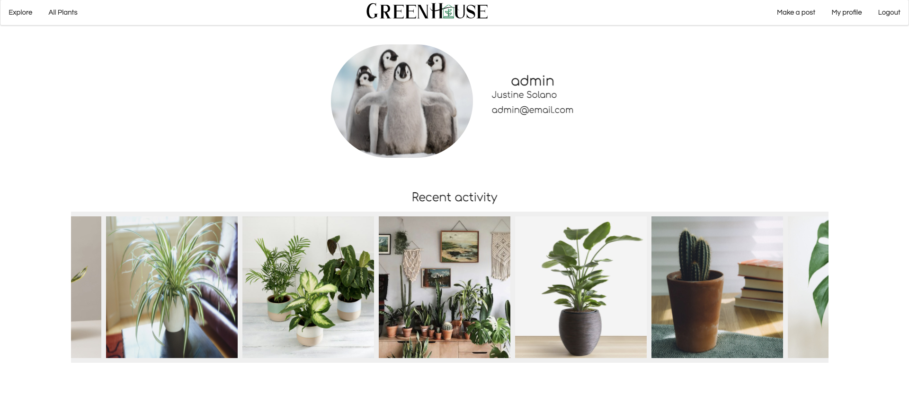
 
## Wins, hurdles and unsolved problems
### Wins:
All the errors, big and small, really helped push my problem-solving skills and helped me to better understand the code and the way it worked. This was especially valuable in this project because it was my first experience using Python and the set up was quite tumultuous at the beginning.
 
Another unexpected win was working solo. I was very nervous doing this project on my own at first as I had not worked by myself since project one and doubted my coding skills often. However, it allowed me to be more decisive, have full creative control over the design, and feel more confident knowing that I had done everything on my own merit.
 
By the end, I felt much more self-assured in my coding ability.
 
### Hurdles:
Delving deeper into the complexities of the SQL database and Django was definitely a large curveball, especially with the time constraints. I spent more time figuring out the backend setup and getting it to work successfully than I had intended, leaving less time for the frontend which then left less time for styling. Although the design looked better than I expected, I only had less than 8 hours for styling when I would've liked at least a day or two to fully get the app looking more slick, especially the UserProfile component.
 
### Unsolved problems:
I would have liked to implement a categories search filter for the PlantShow page. I also did not have time to go over the error handling for the forms. Most of the deployed app was functional except for the categories image not showing up on the bottom slider of the homepage. Submitting a new post on the deployed app also has trouble with the POST request when the submit button is pressed but is working fine on the local server. The deployed app also changes the position of the comments on each plant page to be right-aligned instead of centered.
 
## Extra features/improvements
- Users can favourite plants and have them show up on the favourites page.
- Fully responsive design
- Authenticated users can comment on other users' posts
- Users can edit their profile picture
- Users can edit or delete comments/posts