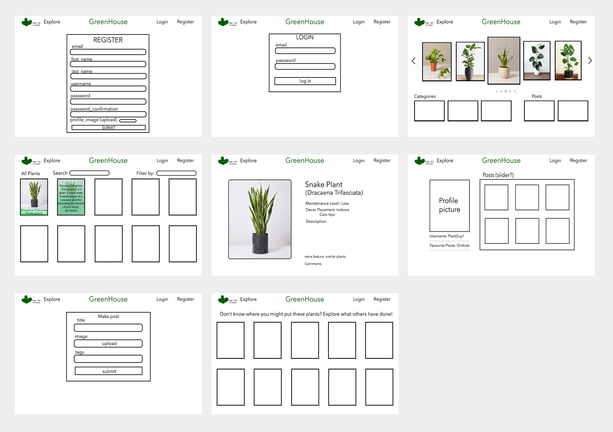

# General Assembly Project 4: GreenHouse

----
# Table of Contents
* Project Brief
* Project Description
* Technologies & Installation
* Process
    - Planning
    - Backend
    - Frontend
* Final Walkthrough
* Wins & bugs
* Extra Features

## Project Brief:
* **Build a full-stack application** by making your own backend and your own front-end
* **Use a Python Django API** using Django REST Framework to serve your data from a Postgres database
* **Consume your API with a separate front-end** built with React
* **Be a complete product** which most likely means multiple relationships and CRUD functionality for at least a couple of models
* **Implement thoughtful user stories/wireframes** that are significant enough to help you know which features are core MVP and which you can cut
* **Have a visually impressive design** to kick your portfolio up a notch and have something to wow future clients & employers. **ALLOW** time for this.
* **Be deployed online** so it's publicly accessible.

## Timeframe:
7 Days

## Description:
GreenHouse allows users to browse for different types of plants to use for interior/exterior decorating. It also allows them to share their own pictures. These pictures appear on the Explore page, a compilation of all posts submitted.

# GreenHouse


### Deployed version:
https://greenhouse-app.herokuapp.com/

To explore the app, use these login credentials:

<b>email</b>: admin@email.com <br />
<b>password</b>: adminpass

## Technologies used
### Frontend:
- React
- Axios
- Semantic UI React
- Semantic UI
- SCSS
- HTTP-proxy-middleware
- React Router DOM
### Backend:
- Python
- Django
- Django REST Framework
- Psycopg2
- PyJWT
### Development tools:
- VSCode
- Insomnia
- Yarn
- Git & GitHub
- Google Chrome development tools
- Miro (storyboard)
- Trello Board (planning)
- Adobe Photoshop 2021 (logo and wireframes)
- Heroku (deployment)

## Installation
Clone or download sei-project-four repo then run these in Terminal:
* `pipenv` to install Python packages
* `pipenv shell` to enter virtual environment
* `python manage.py makemigrations` to prepare migrations
* `python manage.py migrate` to migrate
* `python manage.py loaddata comments/seeds.json` to seed data for comments
* `python manage.py loaddata categories/seeds.json` to seed data for categories
* `python manage.py loaddata plants/seeds.json` to seed data for plants
* `python manage.py loaddata posts/seeds.json` to seed data for user posts
* `python manage.py runserver` to start back-end server
* `cd client` to go into the front-end directory
* `yarn` to install front-end dependencies
* `yarn start` to start front-end server

# PROCESS
## PLANNING (day 1)
## Concept
From the start of the course, I had planned on doing a plant-centric app/website so I immediately knew that that was what I would do for my final project. I decided to do the project solo because I wanted to prove to myself that I could do a more complex website and understand the combination of concepts better through independent struggling and problem-solving. At the beginning of the planning stage, I made sure to establish first the "story" of the app and the way components linked/interacted with each other. I used Miro to create the steps representing the user journey and Photoshop to create a wireframe and ERD.

### Relationships (ERD)


### Storyboard


### Wireframes


I knew that having complex interlinked models in a solo project would be easily overwhelming so I used a Trello board to organise myself. I split the project into backend, frontend, webpages(components), extra functions and bugs, including a list for components that are finished and styled. This definitely helped me delegate tasks evenly each day and to see what I need to prioritise in order to reach the minimum viable product (MVP). Although working on my own, I made sure to stay on Zoom all day in case I needed to quickly reach out to instructors for help which I did twice throughout the project. I also made sure to use and check Slack regularly for help from my classmates or to see if they were having similar obstacles. It made things go smoother and less stressful.

### Trello Organisation


## BACKEND (day 2 & 3)
### Setup
To create a PostgreSQL database, I used a Django REST Framework. The backend has 5 models: categories, comments, users, plants and user posts.

The jwt_auth app was created first to ensure that the user model was established <i>before</i> I needed to create a superuser to access the database.
``` python
class User(AbstractUser):
    email = models.CharField(max_length=50, unique=True)
    first_name = models.CharField(max_length=50)
    last_name = models.CharField(max_length=50)
    profile_image = models.CharField(max_length=1000)
```

The Plant Model was the main model for the database:
``` python
class Plant(models.Model):
    plantname = models.CharField(max_length=50)
    scientificname = models.CharField(max_length=50)
    description = models.CharField(max_length=400)
    careinstructions = models.CharField(max_length=1500)
    family = models.CharField(max_length=50)
    size = models.CharField(max_length=50)
    maintenancelevel = models.CharField(max_length=50)
    bestsuited = models.CharField(max_length=50)
    image = models.CharField(max_length=1000)
    decorativebonus = models.PositiveIntegerField()
    averageprice = models.PositiveIntegerField()
    categories = models.ManyToManyField('categories.Categories', related_name="plants")
    owner = models.ForeignKey(
        'jwt_auth.User',
        related_name='created_plants',
        on_delete = models.CASCADE
    )

    def __str__(self):
        return f"{self.plantname} - {self.scientificname}"
```

The field `careinstructions` was added after I had connected the backend to the frontend. Most of the fields were filled in using information from https://www.patchplants.com/gb/en/. Each plant image used was from this website.

The plants app views.py has 4 different requests:
``` python
class PlantListView(APIView):
    permission_classes = (IsAuthenticatedOrReadOnly,)  
    
    # ALL PLANTS
    def get(self, _request):
        plants = Plant.objects.all() # return everything from the db
        serialized_plants = PopulatedPlantSerializer(plants, many=True) # convert the data
        return Response(serialized_plants.data, status=status.HTTP_200_OK)

    def post(self, request):
        request.data["owner"] = request.user.id
        plant_to_add = PlantSerializer(data=request.data)
        if plant_to_add.is_valid():
            plant_to_add.save()
            return Response(plant_to_add.data, status=status.HTTP_201_CREATED)
        return Response(plant_to_add.errors, status=status.HTTP_422_UNPROCESSABLE_ENTITY)


class PlantDetailView(APIView):

    permission_classes = (IsAuthenticatedOrReadOnly,)  

    def get_plant(self, pk):
        try:
            return Plant.objects.get(pk=pk)
        except Plant.DoesNotExist:
            raise NotFound(detail="🌱 Cannot find that plant")

    # ONE PLANT
    def get(self, _request, pk):
        plant = self.get_plant(pk=pk)
        serialized_plant = PopulatedPlantSerializer(plant)
        return Response(serialized_plant.data, status=status.HTTP_200_OK)

    def delete(self, _request, pk):
        plant_to_delete = self.get_plant(pk=pk)
        plant_to_delete.delete()
        return Response(status=status.HTTP_204_NO_CONTENT)

    def put(self, request, pk):
        plant_to_edit = self.get_plant(pk=pk)
        updated_plant = PlantSerializer(plant_to_edit, data=request.data)
        if updated_plant.is_valid():
            updated_plant.save()
            return Response(updated_plant.data, status=status.HTTP_202_ACCEPTED)
        return Response(updated_plant.errors, status=status.HTTP_422_UNPROCESSABLE_ENTITY)
```
These requests are only available to the admin user and not any user that registers with the website, authenticated or not. Only the posts app POST request and comments app POST request concerns the authenticated user:

<b> posts app views.py </b>
```python
class PostListView(APIView):
    permission_classes = (IsAuthenticatedOrReadOnly,)

    def post(self, request):
        request.data["owner"] = request.user.id 
        post_to_create = PostSerializer(data=request.data) 
        if post_to_create.is_valid():
            post_to_create.save()
            return Response(post_to_create.data, status=status.HTTP_201_CREATED)
        return Response(post_to_create.errors, status=status.HTTP_422_UNPROCESSABLE_ENTITY)
```

<b> comments app views.py </b>
``` python
class CommentListView(APIView):

    permissions_classes = (IsAuthenticated,)

# if comment is valid, save it and return 201 and if not, return error and 422
    def post(self, request):
        request.data["owner"] = request.user.id
        comment_to_create = CommentSerializer(data=request.data)
        if comment_to_create.is_valid():
            comment_to_create.save()
            return Response(comment_to_create.data, status=status.HTTP_201_CREATED)
        return Response(comment_to_create.errors, status=status.HTTP_422_UNPROCESSABLE_ENTITY)
```

Each app's model was tested in Insomnia and TablePlus before moving onto creating the next app. This ensured that I caught any errors for each model without letting them accumulate. I also tested the post and delete requests in the browser using 'localhost:8000/admin/'. This is where I added most of the plants to the database.

Creating a back-end using Python was, although intricate, more straightforward than expected. I found Django to be a reliable database management system. Establishing relationships between 


## FRONTEND (day 3, 4, 5, 6 & 7)
### Authentication

### Register & Login

### Navbar & Homepage
- sliders
- links in navbar

### Plant index and plant show
- all 

### User profile, user posts and make a post

### Styling with Semantic UI and Semantic UI React

### Final project walkthrough

## Wins, major hurdles and unsolved problems

## Key lessons

## Extra features/improvements